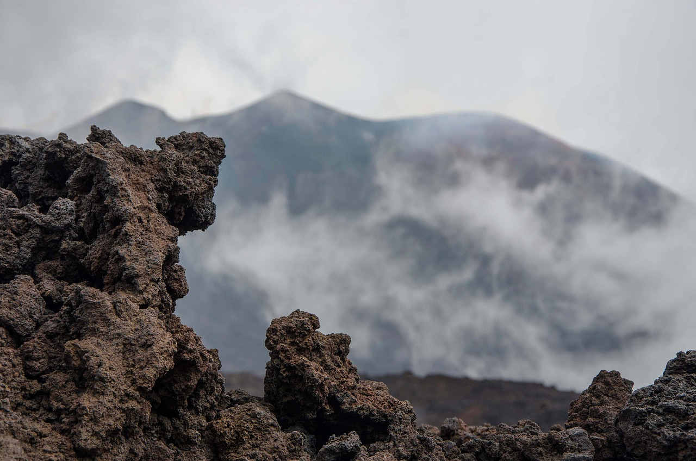
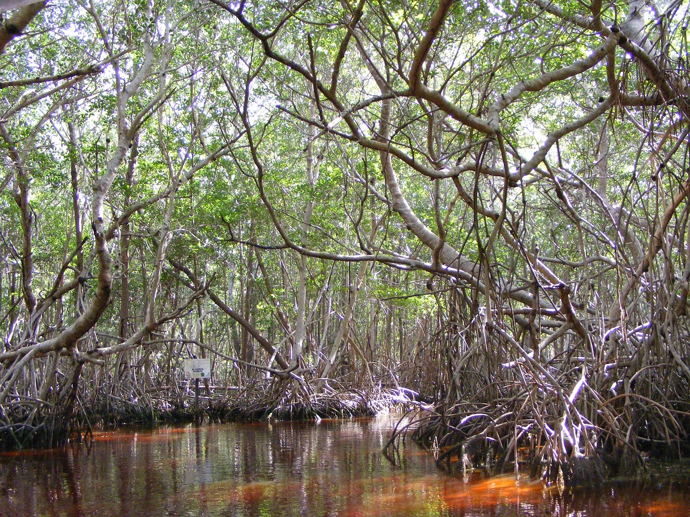
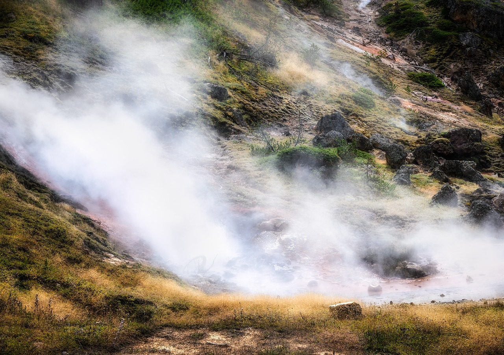
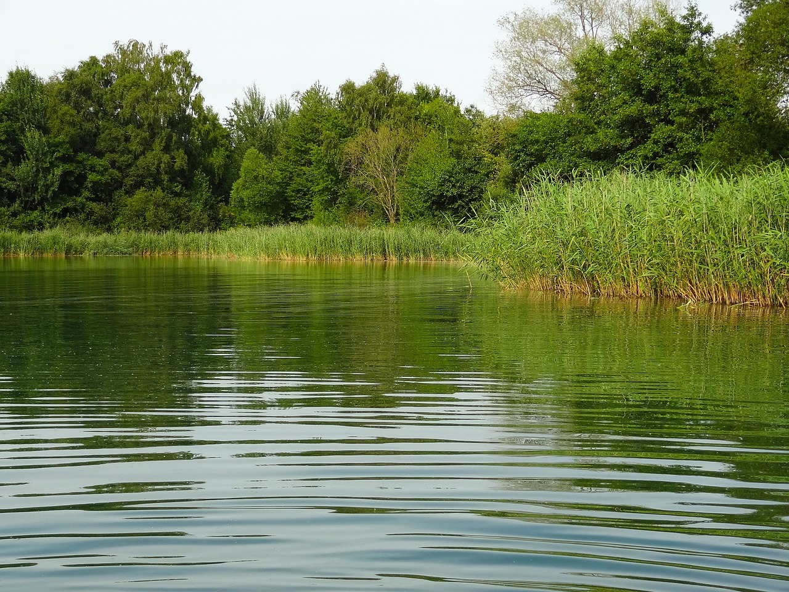

# The Multi-Research-Hub

The MultiResearch-Hub investigates the topics related to the environment such as:

## [Volcanic Activity](research/volcan.md) 

Art by Pixabay. Photo from Pixaline.  

## [Air Quality](research/air_quality.md)

Art by Pixabay. Photo from SD-Pictures. 

## [Mangroves](research/mangroves.md)

Art by Pixabay. Photo from organizatuempresa. 

## [Thermic Heat](research/thermic.md)

Art by Pixabay. Photo from GPoulsen.  

## [Urban Noise](research/urban_noise.md)
 

Art by Pixabay. Photo from aled7.  

## [Water Quality](research/water_quality.md)

Art by Pixabay. Photo from Jan-Mallander. 
