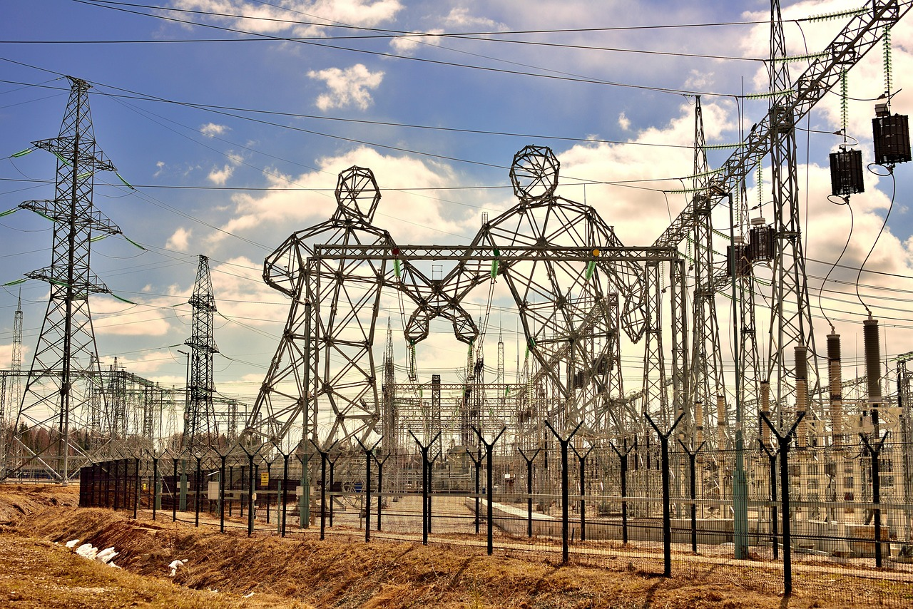

# Frequency Analysis on the Electrical Grid

Reliable electricity depends on a stable frequency, yet Central America has few public studies examining this critical metric. To help fill that gap, researchers analyzed El Salvador’s grid data from 2022–2023 using measurements from the national Transaction Unit (UT) SCADA system and the University of El Salvador’s FNET/GridEye sensors. 

The study also links local frequency shifts to regional events by cross-referencing public reports of generation or load losses from the Regional Operating Entity (EOR), including impacts from the Mexican interconnection. This work shows why continuous monitoring and open regional data are key to identifying weak points, preventing outages, and supporting a more resilient power network for El Salvador and its neighbors.

Art by Pixabay. Photo from Vladimir Fill. 

## Publications

J. G. Lúe González, C. A. Arce Aráuz, C. O. Pocasangre, O. O. Flores-Cortez, F. Arévalo, M. R. Arrieta Paternina, J. M. Ramos Guerrero, 
W. D. Meléndez Valle and J. R. Ramos López, ["Analysis of Frequency in El Salvador’s Power Grid: Understanding the period of 2022 to 2023"](https://www.researchgate.net/publication/390221656_Analysis_of_Frequency_in_El_Salvador's_Power_Grid_Understanding_the_period_of_2022_to_2023), 
2024 IEEE 42nd Central America and Panama Convention (CONCAPAN XLII), San Jose, Costa Rica, 2024, pp. 1-6, 
doi: 10.1109/CONCAPAN63470.2024.10933888. 

González, J.G., Arauz, C.A., Jimenez, C.P., Flores-Cortez, O.O., Arévalo, F., Paternina, M.R., Guerrero, J.M., Valle, W.D., and López, J.R., 
"Descriptive Analysis of Frequency on the Electrical Grid in El Salvador. 
A Preliminary Approach from September 2022 to June 2023," 2024 IEEE Central America and Panama Student Conference (CONESCAPAN), 
Panama, Panama, 2024, pp. 1-6, doi: 10.1109/CONESCAPAN62181.2024.10891093.

