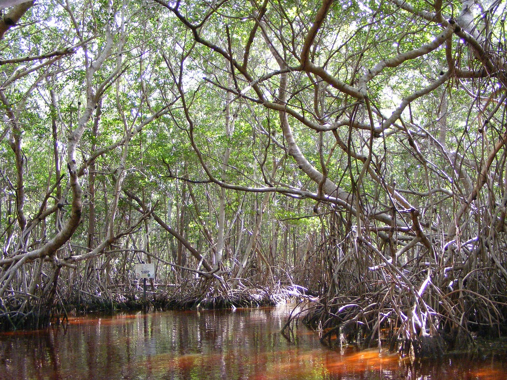

# Monitoring of Mangroves

Mangroves are vital coastal ecosystems that support biodiversity, protect shorelines, and provide essential resources for local communities. Using remote sensing, GIS, and open-access satellite imagery, mangrove cover can be monitored over time to identify changes in vegetation health and spatial distribution.

A temporal analysis of the Jiquilisco Bay Ramsar Site in El Salvador demonstrates how satellite data, NDVI, QGIS, and Python can be combined to assess mangrove dynamics between 2017 and 2024. The observed fluctuations in mangrove cover highlight the potential impacts of climate variability and human activities and emphasize the importance of continuous environmental monitoring for mangrove conservation, sustainable land management, and informed decision-making.

Art by Pixabay. Photo from organizatuempresa. 

## Publications

Flores-Cortez, O.O., Jiménez, C.O.P., Arévalo, F., Galán, R.G., Hernández, S., Landaverde, M.Z. (2026).
“Temporal Analysis of Mangrove Cover Dynamics Using Remote Sensing and GIS in the Ramsar Site of Jiquilisco
Bay, El Salvador”. In: Huang, G., Huang, G., Li, Y., Zeng, Y. (eds) Environmental Science and Technology:
Sustainable Development IV. ICEST 2025. Environmental Science and Engineering. Springer, Cham.
https://doi.org/10.1007/978-3-032-19811-2_10

