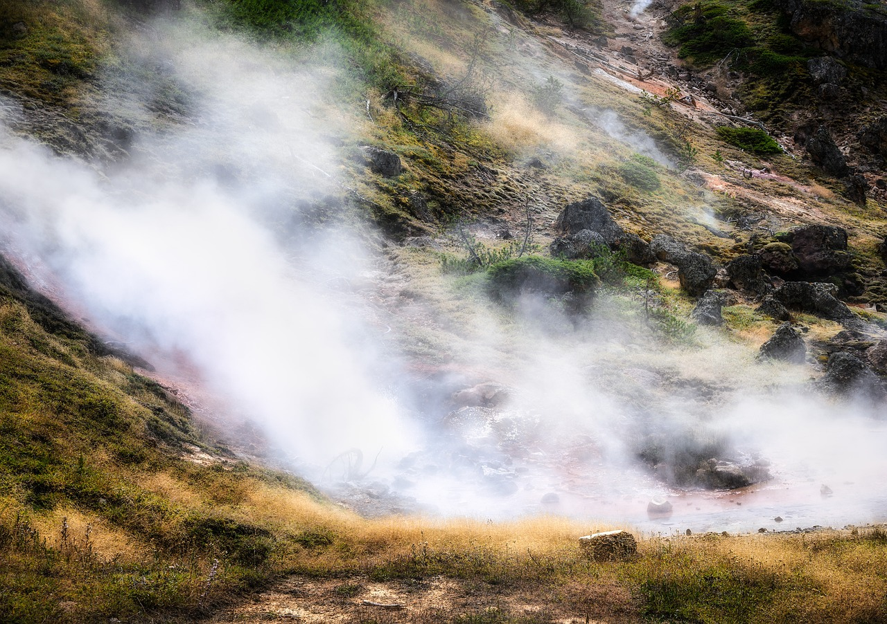

# Monitoring of thermic heat

With advancements in open and low-cost technologies, estimating land surface temperature (LST) using satellite remote sensing has become a viable alternative to traditional methods. LST is a key factor in understanding energy and water exchanges between land and atmosphere, influencing evaporation, crop production, and climate conditions.

In El Salvador, climate monitoring is limited, with only 27 weather stations covering the entire country. This study proposes a low-cost methodology for LST estimation using Landsat 8 satellite imagery and QGIS software. By leveraging thermal infrared data (8–14 μm), this approach enables accurate temperature mapping in areas lacking ground-based monitoring.

The method was tested in the rural cities of Berlin, Alegría, and Santiago de María, demonstrating its effectiveness in identifying potential agricultural stressors like heatwaves and water scarcity. This research provides a scalable solution for climate monitoring and land-use decision-making in regions with limited resources.

Art by Pixabay. Photo from GPoulsen.  

## Publications

Flores-Cortez, O.O., Pocasangre, C., Arévalo, F., Hernández, S. (2024). ["Estimation
of Land Surface Temperature Using Satellite Remote Sensing, a Case Study in the
Cities from El Salvador: Berlin, Alegría, and Santiago de María."](https://www.researchgate.net/publication/385633564_Estimation_of_Land_Surface_Temperature_Using_Satellite_Remote_Sensing_a_Case_Study_in_the_Cities_from_El_Salvador_Berlin_Alegria_and_Santiago_de_Maria) In: Carlos-Martinez,
H., Tapia-McClung, R., Moctezuma-Ochoa, D.A., Alegre-Mondragón, A.J. (eds)
Recent Developments in Geospatial Information Sciences. iGISc 2023. Lecture Notes
in Geoinformation and Cartography. Springer, Cham. https://doi.org/10.1007/978-
3-031-61440-8_6.
