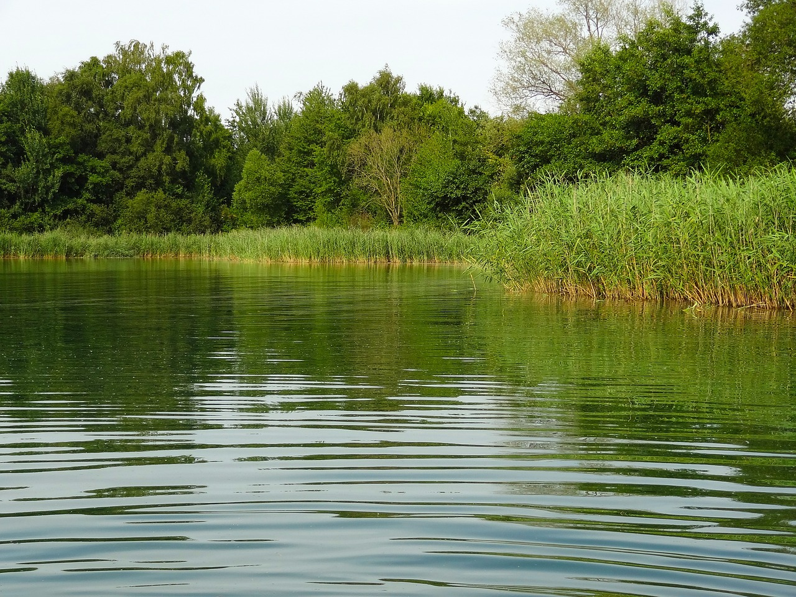

# Monitoring of water quality

Water quality is essential for environmental health and economic activities like fish farming. However, monitoring water parameters can be challenging in countries with limited resources and infrastructure, such as El Salvador. The lack of real-time monitoring can negatively impact fish health and production efficiency.

This study proposes a low-cost IoT-based system for real-time water quality monitoring. The system integrates an Atmega328 microcontroller with pH, dissolved oxygen (DO), and temperature sensors, along with a Wi-Fi transceiver for remote data transmission. A web application allows users to access real-time measurements and monitor water conditions from anywhere.

A pilot test was conducted in a fish farm in El Salvador, demonstrating that the system effectively tracks water parameters. The results highlight its potential as an affordable and efficient solution for aquaculture and other water-dependent industries. This technology offers a scalable approach to improving water quality management in resource-limited regions.

Art by Pixabay. Photo from Jan-Mallander. 

## Publications

W. D. M. Valle, C. O. P. Jiménez, O. O. Flores-Cortez, F. Arévalo, J. Angulo, G. Barahona, O. Flores, C. Silva, "A
Low-Cost LoRa-Enabled IoT Weather Station: A Case Study in an Aquaculture Field in El Salvador," 2025 IEEE
43rd Central America and Panama Convention (CONCAPAN XLIII), San Salvador, El Salvador, 2025, pp. 1-6,
doi: 10.1109/CONCAPAN66820.2025.11512349.

O. O. Flores-Cortez, J. M. Castro Elizondo, A. C. Flores Portillo, F. Arévalo
and C. O. Pocasangre, ["An IoT-Based System for Water Parameters Monitoring.
Case Study: Fish Farming in El Salvador,"](https://www.researchgate.net/publication/382128143_An_IoT-Based_System_for_Water_Parameters_Monitoring_Case_Study_Fish_Farming_in_El_Salvador) 2024 IEEE International Workshop on
Metrology for Industry 4.0 & IoT (MetroInd4.0 & IoT), Firenze, Italy, 2024, pp.
123-128, doi: 10.1109/MetroInd4.0IoT61288.2024.10584126.